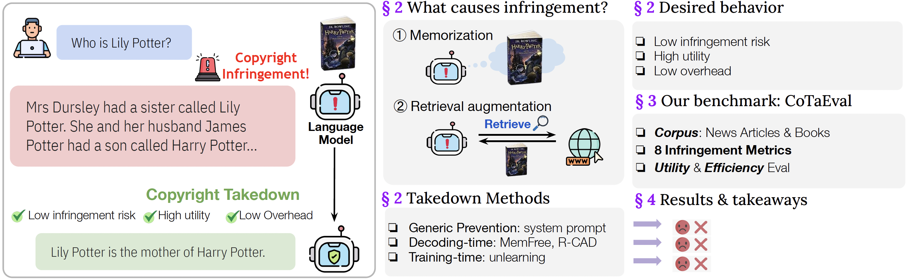

# Copyright Takedown Evaluation (CoTaEval)

This repository provides an original implementation of *Evaluating Copyright Takedown Methods for Language Models* by Boyi Wei*, Weijia Shi*, Yangsibo Huang*, Noah A. Smith, Chiyuan Zhang, Luck Zettlemoyer, Kai Li, and Peter Henderson. (*Equal contribution)

[Website](https://cotaeval.github.io/) | [Dataset](https://huggingface.co/datasets/boyiwei/CoTaEval) | [Paper](https://arxiv.org/abs/2406.18664) | [Leaderboard](https://huggingface.co/spaces/boyiwei/CoTaEval_leaderboard)



**CoTaEval** is a benchmark that can evaluate the feasibility and the side effects of the copyright takedown methods of language models. It can evalaute the effectiveness of copyright takedown, their impact on the model's blocklisted/in-domain/general utility, and the impact of efficiency, providing a comprehensive evaluation from different perspectives.


## Content
1. [Setup](https://github.com/boyiwei/CoTaEval?tab=readme-ov-file#setup)
2. [Evaluate Infringement](https://github.com/boyiwei/CoTaEval?tab=readme-ov-file#evaluate-infringement)
3. [Evaluate Utility](https://github.com/boyiwei/CoTaEval?tab=readme-ov-file#evaluate-utility)
4. [Evaluate Efficiency](https://github.com/boyiwei/CoTaEval?tab=readme-ov-file#evaluate-efficiency)
5. [Result Anlysis](https://github.com/boyiwei/CoTaEval?tab=readme-ov-file#result-analysis)
6. [Citing](https://github.com/boyiwei/CoTaEval?tab=readme-ov-file#cite)

## Setup

You can use the following instructions to create a conda environment
```bash
conda env create -f environment.yml
```
Please notice that you need to specify your environment path inside ``environment.yml``

After initializing the environment, we need to install a modified ``transformers`` library for R-CAD deployment. You can use the following instruction for installation:

```bash
cd cad/transformers_cad
pip install -e .
```

## Evaluate Infringement

### Quick Start
The main entry for infringement evaluation is ``main.py``. After running ``main.py``, it will output a ``.csv`` file in ``res/output_res``, which contains the raw output of the model.

#### Evaluate Infringement in the RAG setting
For example, in the RAG setting under the news articles domain, if we want to evaluate the infringement risk and utility in the vanilla case, using Llama-2-7B-chat model, we can use the following command:
```bash
python main.py --model_name llama2-7b-chat-hf --num_test 1000 --context_len 200 --completion_len 200 --datatype newsqa --intervention none --eval_infringement
```

#### Evaluate Infringement in the memorization setting

For example, in the memorization setting under the news articles domain, if we want to evaluate the infringement risk and utility in the vanilla case, using Llama-2-7B-chat model fine-tuned on news articles, we can use the following command:

```bash
python main.py --model_name llama2-7b-chat-hf_newsqa --num_test 1000 --context_len 200 --completion_len 200 --datatype newsqa --intervention none --eval_infringement --no_context
```
Here ``llama2-7b-chat-hf_newsqa`` refers to Llama2-7b-chat-hf model fine-tuned on news articles in NewsQA dataset. The checkpoint of this model is available [here](https://huggingface.co/swj0419/llama2-7b_chat_newsqa). In the memorization setting, we don't provide context during the evluation. Therefore, we need to set ``--no_context`` as True.

### Argument Details
Important parameters are:
1. ``--model_name``: To specify the model for evaluation. The model name and the path for loading the model can be specified via ``modeltype2path``: Dictionary in ``main.py``
2. ``--datatype``: To specify the evaluation domain. Available options are ``newsqa`` (for the news articles domain) and ``booksum`` (for the books domain).
3. ``--num_test``: Number of examples to test for infringement evaluation. For news articles, we set 1000 as default. For books, we set 500 as the default.
4. ``--context_len``: The length of the hint. We set 200 as the default.
5. ``--completion_len``: The maximum number of generated tokens. We set 200 as the default.
6. ``--eval_infringement``: If true, perform infringement test.
7.  ``--intervention``: Intervention methods.
8.   ``--no_context``: If true, we don't provide the context in the infringement and utility evaluation. For memorization settings.
### Specific Takedown Methods Evaluation

#### System Prompt

When evaluating system prompt, we need to specify which system prompt we are evaluating in ``--intervention``. Available options are: ``sys_prompt-dbrx, sys_prompt-bing, sys_prompt-copilot, sys_prompt-sys_a, sys_prompt-sys_b, sys_prompt_sys_c``. Here ``sys_a``, ``sys_b``, and ``sys_c`` correspond to the three manually created system prompts in Appendix C.1.
#### MemFree
When evaluating Memfree, please make sure that the Redis has been started. For example, if we want to evaluate Memfree with $n$-gram size equals 6, we can use the following command:
```bash
cd data-portraits
python easy_redis.py --shutdown
python easy_redis.py --start-from-dir your/path/to/bloom_filter/${datatype}_tokenized/$ngram
cd ..
python main.py --model llama2-7b-chat-hf --num_test 1000 --context_len 200 --completion_len 200 --datatype newsqa --intervention memfree_tokenized_consecutive --n 6 --eval_zero_shot --eval_general --eval_infringement
```
For details on how to create the bloom filter using Data Portraits, please refer to [memfree_usage.md](https://github.com/boyiwei/CoTaEval/blob/main/data-portraits/memfree_usage.md)

When evaluating Memfree, we need to specify ``--intervention`` as ``mem_free_tokenized_consecutive``, and specitfy ``--n``, which is the size of $n$-gram stored in the bloom filter.
#### Top-K perturbation
When evaluating top-k perturbation, we need to specify ``--intervention`` as ``top_k``, and specify ``--std``, which is the standard deviation of the Gaussian noise added to the logits distribution.

#### R-CAD

When evaluating R-CAD, we need to specify ``--intervention`` as ``cad``, and specify the value of ``--context_aware_decoding_alpha``, which is the weight of adjustment $\alpha$ in R-CAD.

#### Unlearning

For unlearning methods, we use the framework provided in [TOFU](https://github.com/locuslab/tofu). When perform unlearning, we need to use our dataset as [forget set](https://huggingface.co/datasets/boyiwei/CoTaEval/blob/main/newsqa_forget_set.json) and [retain set](https://huggingface.co/datasets/boyiwei/CoTaEval/blob/main/newsqa_retain_set.json). After having the unlearned the model, we can evaluate their performance following the procedure above, with ``--intervention none``. We also provide 4 unlearned model checkpoints in huggingface ready for evaluation, including [Gradient Ascent (lr=1.5e-6, epoch=1)](https://huggingface.co/boyiwei/llama2-7b_chat_newsqa_GA_1.5e-6_1), [Gradient Difference(lr=3e-6, epoch=1)](https://huggingface.co/boyiwei/llama2-7b_chat_newsqa_GD_3e-6_1), [KL Minimization (lr=2e-6, epoch=1)](https://huggingface.co/boyiwei/llama2-7b_chat_newsqa_KL_2e-6_1), and [Preference Optimization (lr=5e-5, epoch=4)](https://huggingface.co/boyiwei/llama2-7b_chat_newsqa_PO_5e-5_4).


### Adding custom takedown methods

Besides the takedown methods provided in the code, you can also add your custom takedown methods and evaluate their performance. To new method, you need to add a new code block starting here](https://github.com/boyiwei/CoTaEval/blob/main/main.py#L80), where you can add a new if branch with the implementation of the new takedown methods.

## Evaluate Utility

### Evaluate Blocklisted Utility, In-Domain Utility, and MMLU

The main entry for evaluating the blocklisted utility, in-domain utility and MMLU is ``main.py``. To evaluate utility, we need to add the following arguments:

1. ``--eval_zero_shot``: If true, evaluate the blocklisted and in-domain utility.
2. ``--eval_general``: If true, evaluate the MMLU score.

When ``--no_context`` is true, the context is not provided in the utility evaluation as well.

For example, if we want to evaluate the blocklisted utility, in-domain utility, and MMLU on Llama2-7b-chat-hf model, we can use the following command:

```bash
python main.py --model_name llama2-7b-chat-hf  --datatype newsqa --intervention none --eval_zero_shot --eval_general
```

### Evaluate MT-Bench
We use the [FastChat](https://github.com/lm-sys/FastChat) to compute the MT-bench score. The code is in ``eval/FastChat_new``. To run MT-Bench, use the following command:
```bash
cd eval/FastChat_new/fastchat/llm_judge

python gen_model_answer.py --model-path your/path/to/the/model --model-id llama2-7b-chat-hf_none --intervention none
```

You can specify the intervention type following ``--intervention``

After having the model's answer, we need to run ``python gen_judgment.py --model-list <the model list you want to eval> --parallel 5`` to generate the judgement. Then we can use ``python show_result.py`` to show the MT-Bench score for all the models.

## Evaluate efficiency

The main function for evaluating the efficiency is ``main_efficiency.py``. The key difference between ``main_efficiency.py`` and ``main.py`` is in ``main_efficiency.py`` we set ``max_new_tokens=min_new_toknes=200`` for fair comparison. For example, to test the efficiency of top-k perturbation, we can use the following command:
```bash
python main_efficiency.py --model_name llama2-7b-chat-hf --num_test 1000 --context_len 200 --completion_len 200 --datatype newsqa --intervention top_k --std 3
```

## Metrics Computation
### Compute infringement metrics
#### Compute all eight metrics
To facilitate the win rate computation, we need to reformat the output file, and compute all the 8 metrics (ROUGE-1, ROUGE-L, LCS(character), LCS(word), ACS(word), Levenshitein Distance, Semantic Similarity, MinHash Similarity) for each example. We use ``process.py`` to do so. After running ``main.py``, it will output a ``.csv`` file in ``res/output_res``, which contains the raw output of the infringement test. After having the file in ``res/output_res``, we can process the raw output to another ``.csv`` file with all metrics. For example, if we have a raw output file in ``res/output_res/newsqa_low_ppl_comp_llama2-7b-chat-hf_context_len_200_completion_len_200_intervention_none_no_context_False.csv``, we can process it by using:
```bash
python process.py --input_dir res/output_res --output_dir res/output_res_processed --file_name newsqa_low_ppl_comp_llama2-7b-chat-hf_context_len_200_completion_len_200_intervention_none_no_context_False.csv
```
It outputs a ``.csv`` file to ``res/output_res_processed``, which contains all 8 metrics for infringement evaluation. We also need to notice that sometimes there are a few examples that will lead the model to output nothing in the vanilla case, we call them "invalid ids". For fair comparison purposes, we also need to zero out all the "invalid ids" for different takedown methods under the same model and domain.
#### Compute the win rate

After having the processed `.csv` file, we can use ``winrate_compute.py`` to compute the winrate for different intervention methods. For example, if we want to compute the win rate for different takedown methods for Llama2-7B-chat model, under the news articles domain and RAG scenario, we can use the following command:
```bash
python winrate_compute.py --data_type news --model_name llama2_7b_chat --scenario rag
```
It will output ``win_rate_memorization.csv``, with per-metric and average win rate for each takedown method inside it.

### Compute utility and efficiency metrics
The data of utility and efficiency will be logged in ``res/utility_res``, where you can see the F1/ROUGE score, MMLU score, and tokens/sec in ``log_*.txt``, here ``*`` refers to the model name.


## Citing

If you find our work useful, please cite our work 😊
```
@article{wei2024evaluating,
  title={Evaluating Copyright Takedown Methods for Language Models},
  author={Wei, Boyi and Shi, Weijia and Huang, Yangsibo and Smith, Noah A and Zhang, Chiyuan and Zettlemoyer, Luke and Li, Kai and Henderson, Peter},
  journal={arXiv preprint arXiv:2406.18664},
  year={2024}
}
```


